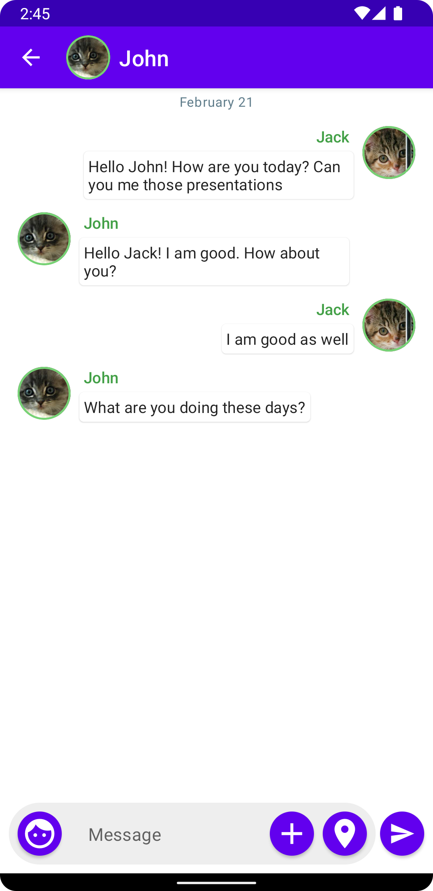

# Explore Jetpack compose

Repo to track personal journey about exploring and learning Jetpack Compose (A declarative way to
define Android UI)

## Screenshots

### Composable preview

### Emulator preview

