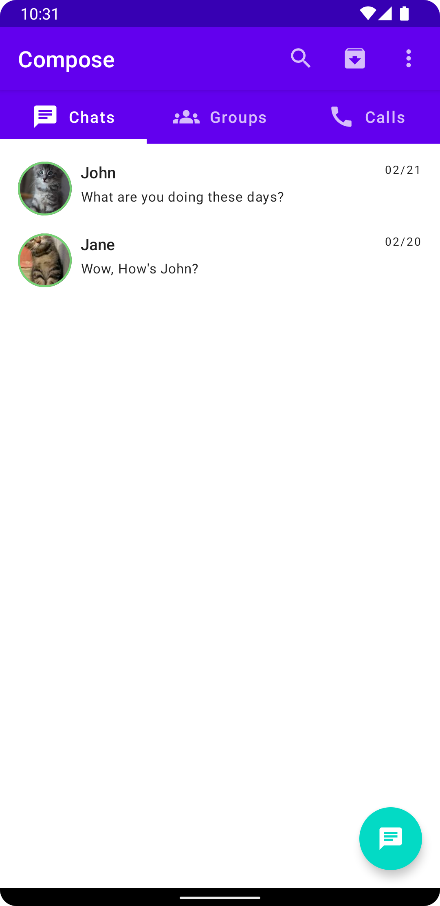

# Explore Jetpack compose

  
  

Repo to track personal journey about exploring and learning Jetpack Compose (A declarative way to
define Android UI) and other state of art Android libraries

### Libraries explored

#### UI

- [Jetpack Compose](https://developer.android.com/jetpack/compose): To define Android UI in _
  declarative_ way
    - [Navigation](https://developer.android.com/jetpack/compose/navigation): _The Navigation
      component providing support for Jetpack Compose_
    - [Accompanist](https://github.com/google/accompanist): Collection of _libraries that aim to
      supplement Jetpack Compose_

#### Data

- [Room](https://developer.android.com/jetpack/androidx/releases/room): _SQLite abstraction_ for
  Android
- [DataStore](https://developer.android.com/topic/libraries/architecture/datastore): Storage
  solution to _asynchronously, consistently, and transactionally_ store key-values or Protobuf

#### Core

- [Hilt](https://dagger.dev/hilt/): Simplifies _Dagger implementation_ on Android
- [WorkManager](https://developer.android.com/topic/libraries/architecture/workmanager): _The
  recommended solution for persistent work_
- [kotlinx.serialization](https://kotlinlang.org/docs/serialization.html): _Kotlin multiplatform
  reflectionless serialization_
- [kotlinx-datetime](https://github.com/Kotlin/kotlinx-datetime): _A multiplatform Kotlin library
  for working with date and time_
- [kotlinx.coroutines](https://kotlinlang.org/docs/coroutines-overview.html): _Way to write
  asynchronous code that is readable and maintainable_

#### Testing

- [Turbine](https://github.com/cashapp/turbine): _Testing library for kotlinx.coroutines Flow_
- [MockK](https://mockk.io/): _Mocking library for Kotlin_

#### Style

- [ktlint](https://github.com/pinterest/ktlint): Enforces _official Kotlin coding conventions and
  Android Kotlin Style Guide_

#### Build

- [android-emulator-runner](https://github.com/ReactiveCircus/android-emulator-runner): _A GitHub
  Action for installing, configuring and running hardware-accelerated Android Emulators on macOS
  virtual machines._

## Screenshots

### Composable preview

### Emulator preview

#### On-boarding

#### Chat

#### Groups

#### Calls

#### Permissions

